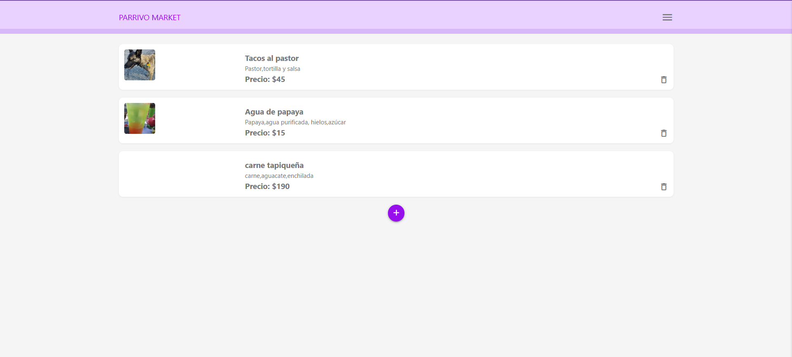
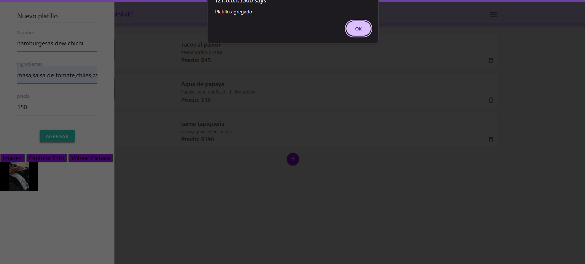
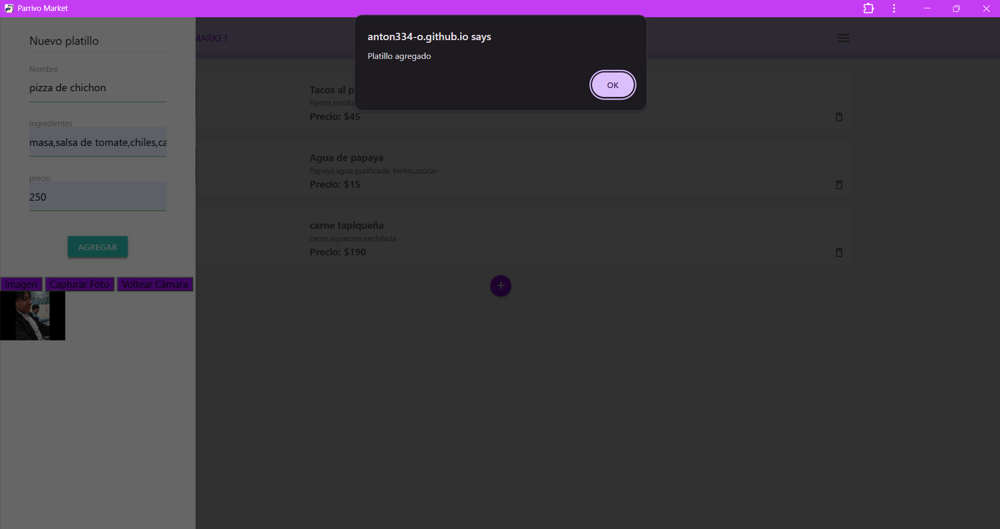
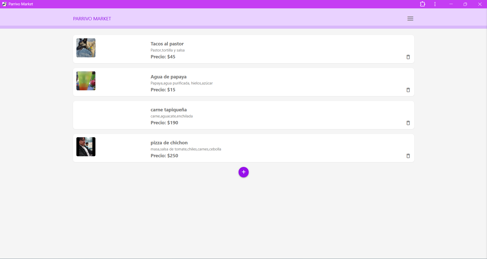
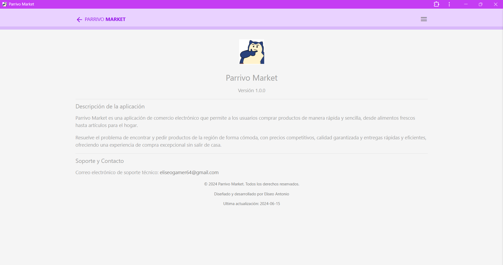
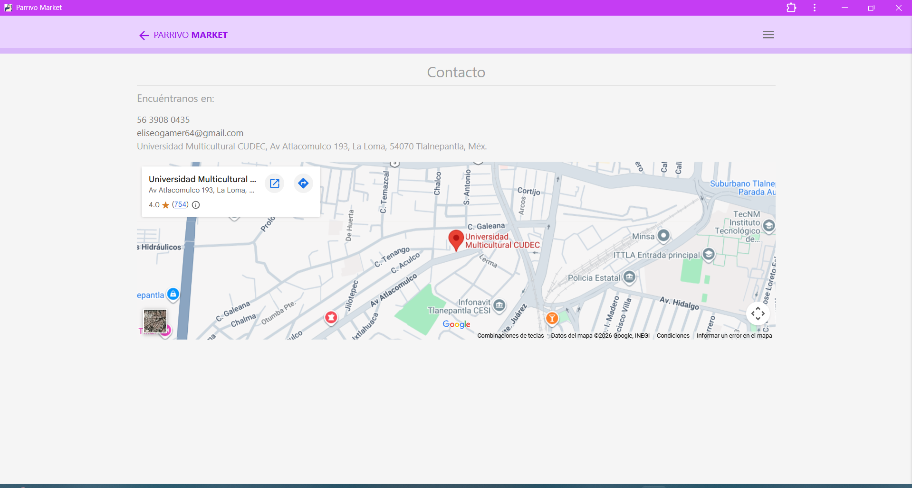

Parrivo Market (UberEatsCUDEC)

## 1. *Título del proyecto*

- **Nombre del proyecto:** Parrivo Market (UberEatsCUDEC)
- **Tipo de aplicación:** PWA (Progressive Web App)
- **Descripción breve:** Aplicación web progresiva para gestionar y ordenar platillos, con captura de foto desde la cámara y ubicación de entrega en mapa.
- **Materia / asignatura:** taller de programsacion avanzada 2
- **Carrera:** Ingeniería en Sistemas Computacionales
- **Alumno:** Eliseo Antonio Teobal Parra

## 2. Descripción del proyecto

Parrivo Market es una aplicación de comercio electrónico enfocada en la venta de comida, que permite registrar platillos (nombre, ingredientes, precio y foto tomada desde la cámara del dispositivo) y a los usuarios realizar pedidos indicando el platillo deseado y su ubicación de entrega en un mapa

Sus usuarios principales son:

- El negocio/administrador, que registra y elimina platillos del catálogo.
- Los clientes, que consultan el catálogo y generan pedidos con su ubicación.

## 3. Objetivos

### Objetivo general

Desarrollar una aplicación web progresiva (PWA) que permita administrar un catálogo de platillos y gestionar pedidos con ubicación geográfica, aplicando tecnologías web modernas y una base de datos en la nube.

### Objetivos específicos

- Permitir el registro de platillos con nombre, ingredientes, precio y fotografía capturada desde la cámara del dispositivo.
- Permitir eliminar platillos del catálogo en tiempo real.
- Permitir generar pedidos seleccionando un platillo y una dirección obtenida mediante geolocalización.
- Mostrar la ubicación del pedido en un mapa interactivo.
- Ofrecer páginas informativas de "Acerca de" y "Contacto".

## 4. Características principales

- Registro de nuevos platillos (nombre, ingredientes, precio).
- Captura de foto del platillo desde la cámara del dispositivo, con opción de voltear entre cámara trasera y frontal.
- Listado de platillos en tiempo real (sincronizado con la base de datos).
- Eliminación de platillos desde la lista.
- Módulo de pedidos: selección de platillo, obtención de ubicación actual (GPS) con dirección completa mediante geocodificación inversa, y visualización en mapa (Leaflet).
- Guardado de pedidos con usuario, platillo, dirección y ubicación.
- Página "Acerca de" con información de la aplicación, descripción y soporte.
- Página de "Contacto" con teléfono, correo y mapa de ubicación física.

## 5. Tecnologías utilizadas

- **HTML5 / CSS3 / JavaScript** (Vanilla JS)
- **Materialize CSS** – framework de estilos y componentes UI
- **Firebase Firestore** – base de datos en la nube en tiempo real
- **Leaflet.js** – mapas interactivos
- **Nominatim (OpenStreetMap)** – geocodificación inversa de direcciones
- **Google Maps Embed** – mapa de ubicación fija en la página de Contacto
- **Web APIs del navegador:** `getUserMedia` (cámara), `Geolocation` (GPS)
- **PWA:** Web App Manifest y Service Worker

## 6. Estructura del proyecto

UberEatsCUDEC/
├── index.html   
├── manifest.json   
├── sw.js   
├── css/
│   ├── materialize.min.css
│   └── styles.css  
├── js/
│   ├── materialize.min.js
│   ├── firebase.js  
│   ├── db.js   
│   ├── index.js   
│   ├── pedidos.js   
│   └── sw.js
├── img/
│   ├── dish.png
│   └── pwa-assets/   
└── pages/
    ├── about.html     
    ├── contact.html        
    └── pedidos.html    

## 7. Evidencias / capturas de pantalla

- **Inicio:** 
- 

_

- **Registrar platillo:** 
- 
_

- **Realizar pedido (al terminar de hacer el pedido):** 
- ](image-1.png)
- **Acerca:** 
- 
- **Contacto:** 
## 8. Base de datos

- **Motor utilizado:** Firebase Firestore (base de datos ).
- **Colecciones:**
  - `platillos`: almacena cada platillo con los campos `nombre`, `ingredientes`, `precio` y `foto` (imagen en base64 capturada desde la cámara).
  - `pedidos`: almacena cada pedido con el platillo seleccionado, la dirección/ubicación y el usuario.

## 9. Licencia

Este proyecto fue desarrollado con fines académicos como parte de la carrera Ingeniería en Sistemas Computacionales, para la materia [taller de programacion avanzada 2], del [181] en [cudec].
